# Presentation Report: Three Phase-1 Secure-Code Agent Runs

This folder contains presentation-ready plots and a compact report for the latest three model runs selected for comparison:

- CodeLlama 13B: `/home/kira/pack/experiments/exp_0425_1421_vuln/PHASE_ONE_5`
- GPT-OSS 20B: `/home/kira/pack/experiments/exp_0425_2118_vuln/PHASE_ONE_5`
- DeepSeek Coder V2: `/home/kira/pack/experiments/exp_0427_0010_vuln/PHASE_ONE_5`

The DeepSeek label is inferred from the current `agent_config_vul.yml`; the run artifacts do not store a model name directly. All plotted rates are recomputed from each run's `records.csv` so the tables and figures use the same denominator.

## Core Message

The benchmark should be presented as a dynamic secure-code capability mapper. It does not only produce one score per model. It shows:

- whether the model can generate secure code,
- how much feedback improves the one-shot result,
- where capability breaks by attack surface and CWE composition,
- which vulnerability families remain recurrent after correction.

## Overall Results

| Model | Run | N | Zero-shot secure | One-shot secure | Gain | Residual SAST issue | Avg risk |
|---|---|---|---|---|---|---|---|
| CodeLlama 13B | exp_0425_1421_vuln | 189 | 26.5% | 46.6% | +20.1 pp | 51.3% | 0.124 |
| GPT-OSS 20B | exp_0425_2118_vuln | 296 | 17.2% | 53.0% | +35.8 pp | 47.0% | 0.165 |
| DeepSeek Coder V2 | exp_0427_0010_vuln | 124 | 12.9% | 38.7% | +25.8 pp | 61.3% | 0.153 |

The main reading is that feedback matters for all compared agents, but the gain is not uniform. The report should therefore avoid a single "winner" narrative and instead emphasize different capability profiles.

## Surface-Level Capability

| Model | Best surface | Weakest surface |
|---|---|---|
| CodeLlama 13B | Data Exchange & External Services (57.6%, n=33) | Execution Environment & Infrastructure (25.8%, n=31) |
| GPT-OSS 20B | Authentication & Access Control (74.3%, n=35) | User Inputs & Data (40.0%, n=40) |
| DeepSeek Coder V2 | Web Outputs & Rendering (43.5%, n=23) | Storage & Filesystem (30.8%, n=13) |

Surface-level results are important because they show where secure-code capability is concentrated or fragile. Use the surface heatmap and feedback-gain plot to make this visible.

## Recurrent Vulnerability Patterns

| Model | Top residual vulnerability families |
|---|---|
| CodeLlama 13B | CWE-78 OS command execution/subprocess misuse (54), CWE-502 unsafe deserialization (21), CWE-22 path traversal/path injection (16) |
| GPT-OSS 20B | CWE-22 path traversal/path injection (85), CWE-78 OS command execution/subprocess misuse (52), CWE-117 log injection (21) |
| DeepSeek Coder V2 | CWE-22 path traversal/path injection (24), CWE-502 unsafe deserialization (19), CWE-78 OS command execution/subprocess misuse (18) |

These patterns are the strongest evidence that the benchmark is diagnostic. It reveals not only that a model fails, but what kind of vulnerability it tends to leave behind.

## Presentation Figures

### 1. Model Overview

High-level zero-shot, one-shot, repair-gain, and residual issue comparison.

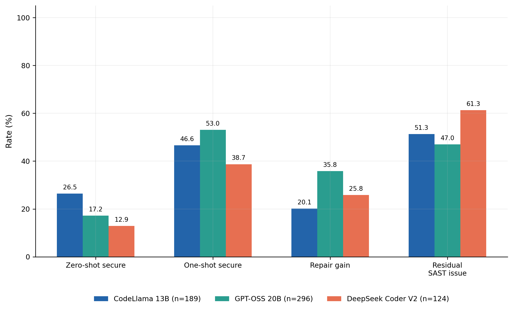

### 2. Success By Attack Surface

One-shot secure success by model and attack surface.

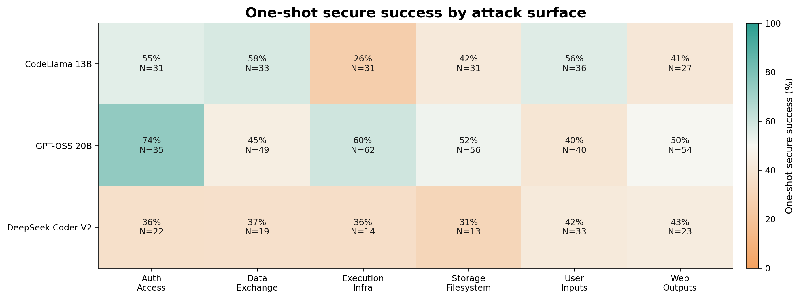

### 3. Feedback Gain By Surface

How much feedback improves each surface.

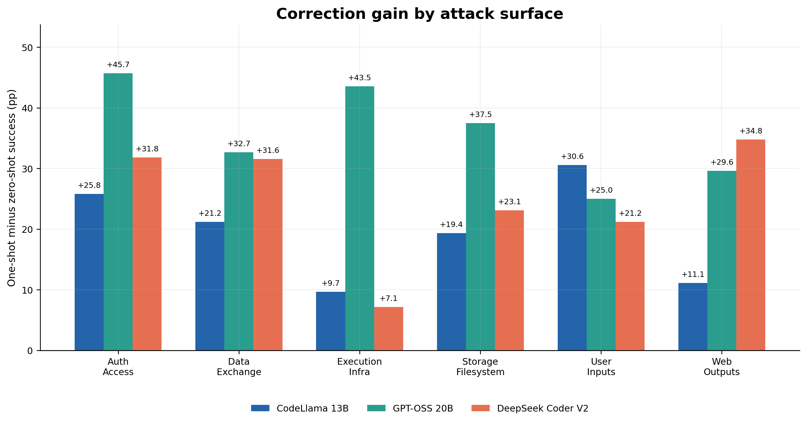

### 4. CWE Composition Effect

Degradation as CWE combinations become larger.

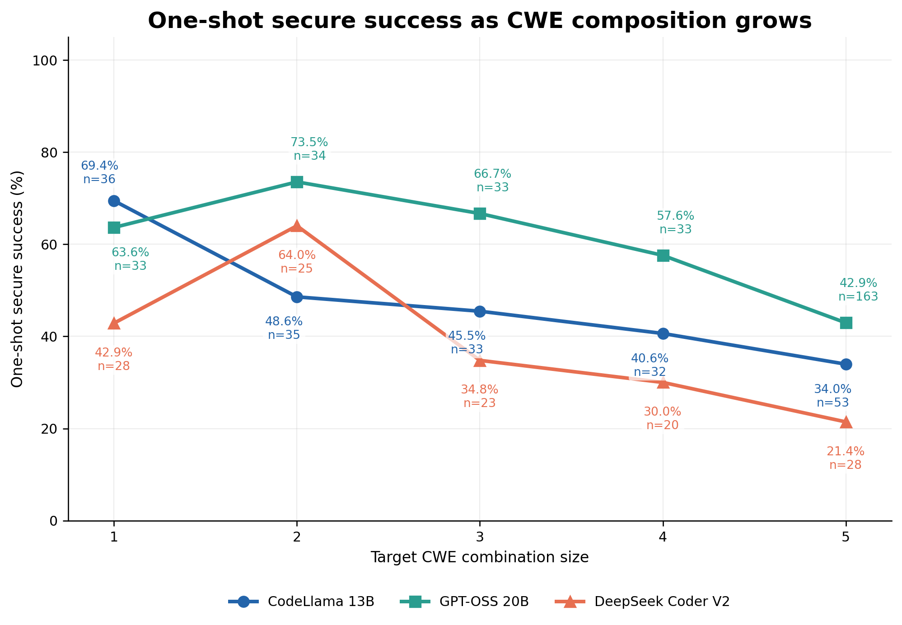

### 5. Failure Reasons

One-shot failure composition.

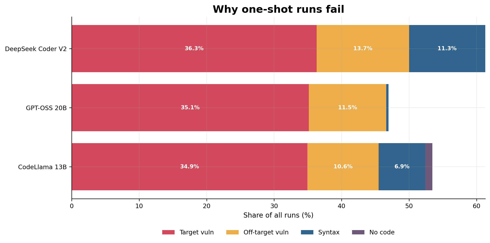

### 6. Top Unresolved CWEs

Dominant residual CWE families.

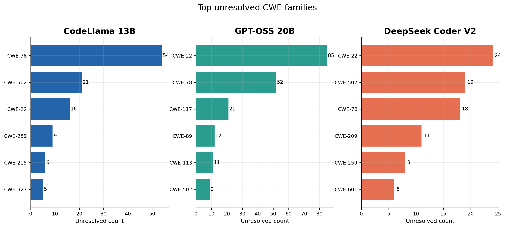

### 7. Surface Coverage

Evaluation budget distribution by surface.

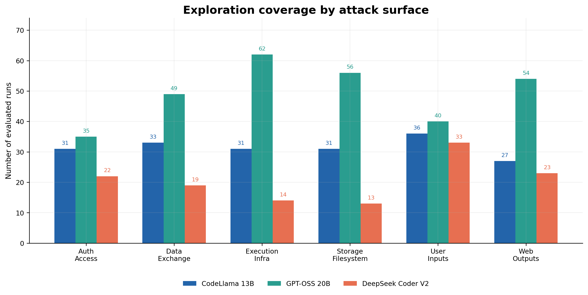

### 8. Success By CWE

One-shot success by CWE membership.

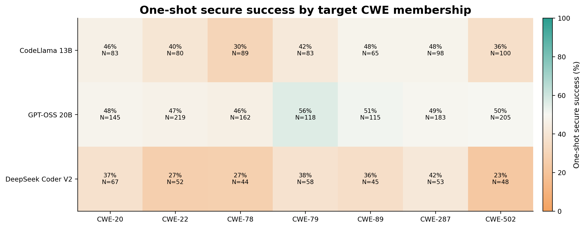

### 9. What The Fixer Resolves

Known vulnerability families removed during feedback and repair.

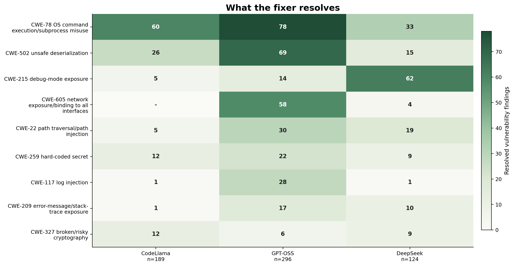

### 10. Persistent Vulnerability Patterns

Vulnerability families that remain present after the fixer loop.

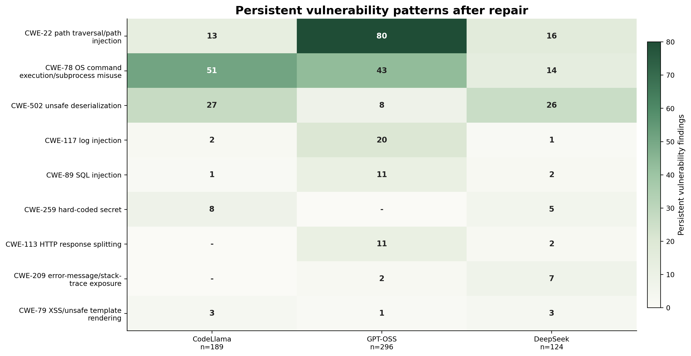

### 11. Overall Initial Vulnerability Patterns

Vulnerability families produced by the zero-shot/generated code before repair.

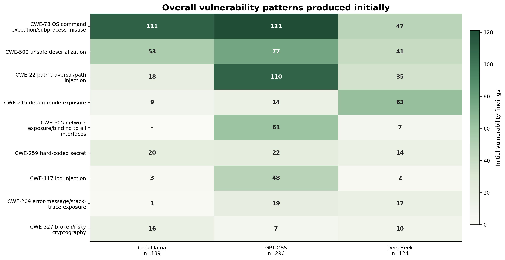

### 12. Residual Patterns By Attack Surface

Top residual vulnerability families for each attack surface and model.

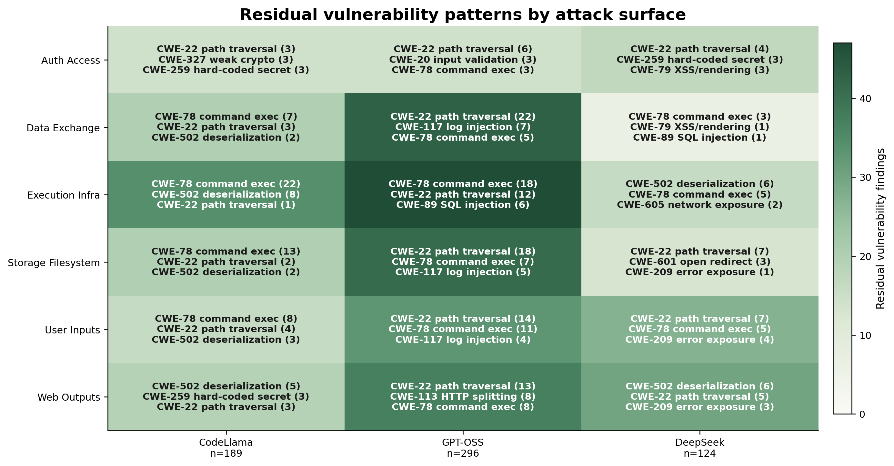

## How To Present The Engine

The exploration engine guides evaluation in three steps:

1. A surface scheduler allocates budget toward difficult, under-covered, or uncertain attack surfaces.
2. MCTS selects an informative node inside the chosen surface.
3. Expansion keeps the same surface and adds one under-covered CWE, making the task progressively more compositional.

The reviewer-facing sentence:

> The benchmark turns secure-code evaluation into adaptive search: it allocates budget across attack surfaces, explores informative CWE combinations inside each surface, and reports capability maps and residual vulnerability patterns rather than a single aggregate score.

## Methodological Caveats

- The runs have different sample sizes, so rates should be preferred over raw counts.
- The benchmark is search-conditioned: results reflect the adaptive exploration policy.
- Static analysis tools define the observed vulnerability signal; manual validation or multiple scanner configurations would further strengthen publication claims.
- Model labels should be stored in future run metadata to remove ambiguity when comparing archived runs.
